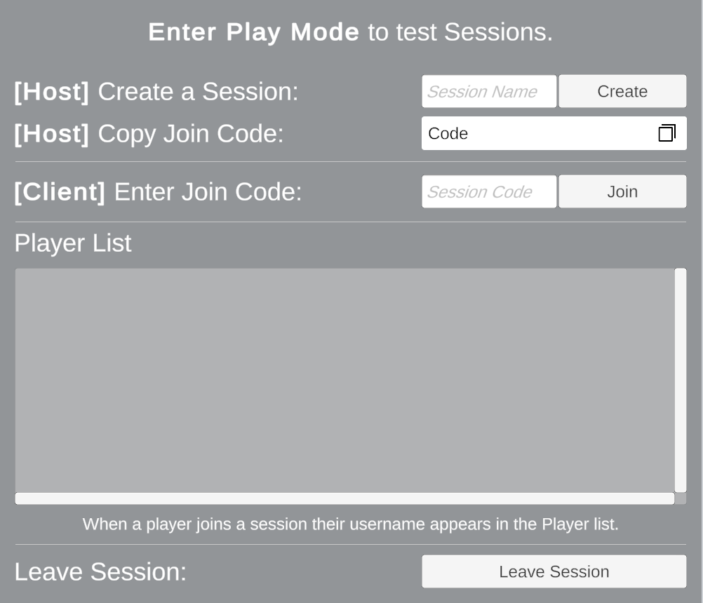

# Use the Multiplayer Center widgets quickstart sample

 The Multiplayer Center window includes the Quickstart tab that you can use to open sample scenes for multiplayer features that exist in your scene. To open it, go to **Window** > **Multiplayer** > **Multiplayer Center**. You can find it in the Quickstart Tab under **Connecting Players/Multiplayer Widgets**.

To access the multiplayer widgets Sample scene from the Multiplayer Center window, use one of the following methods: 
* Create and open a scene that includes the Widgets sample.
* Add the Multiplayer Widgets sample to the [Netcode for GameObjects](https://docs-multiplayer.unity3d.com/netcode/current/about/) sample scene.
* Add the Multiplayer Widgets sample to the [Netcode for Entities](https://docs.unity3d.com/Packages/com.unity.netcode@latest) sample scene.

> [!NOTE]
> To test multiplayer functionality with multiple virtual players in the editor, install [Multiplayer Play Mode](https://docs-multiplayer.unity3d.com/mppm/).

## The Widgets Quickstart sample 

The Widgets Quickstart sample that the Multiplayer Center creates adds the following widgets to the scene's UI: 

* **Create Session**  
* **Copy Join Code**
* **Enter Join Code**
* **Player List**
* **Leave Session**

To learn how to use each multiplayer widget, refer to [Introduction to multiplayer widgets](get-started-learn-widgets.md).

## Create and open the Widgets Quickstart sample scene

To create a sample scene that includes the multiplayer widgets sample:

1. Open the Multiplayer Center window **Window** > **Multiplayer** > **Multiplayer Center**.
2. Select the **Quickstart** tab.
3. Select **Connecting Players**.
4. In the Multiplayer Widgets section, select **Create and open scene with Widget sample**.

## Add the Multiplayer Widgets sample to the Netcode for GameObjects sample scene

To test multiplayer widgets with a networked GameObject in the Netcode for GameObjects sample scene that the Multiplayer Center opens:

1. Open the Multiplayer Center window **Window** > **Multiplayer** > **Multiplayer Center**.
2. Select the **Quickstart** tab.
3. Select **Netcode and Tools**.
4. In the Netcode for GameObjects section **Create and open scene with netcode setup**.
5. Select **Connecting Players**.
6. In the Multiplayer Widgets section, select **Add Widget Quickstart to ConnectionUI Scene.**.
7. Enter Play mode to spawn the networked cube.

## Add the Multiplayer Widgets sample to the Netcode for Entities sample scene

To test multiplayer widgets with a networked entity in the Netcode for Entities sample scene that the Multiplayer Center opens:

1. Open the Multiplayer Center window **Window** > **Multiplayer** > **Multiplayer Center**.
2. Select the **Quickstart** tab.
3. Select **Netcode and Tools**.
4. In the Netcode for Entities section **Create and open scene with netcode setup**.
5. Select **Connecting Players**.
6. In the Multiplayer Widgets section, select **Add Widget Quickstart to NGO_Setup Scene**.
7. Enter Play mode to spawn the networked cube.

When you install the Widgets Quickstart sample with Netcode for Entities installed, it includes the **CustomWidgetsNetworkHander** asset in **Assets** >  **Netcode for Entities Widgets Sample** > **Scripts** > **MyWidgetsNetworkHandler.cs**. This custom NetworkHandler handles World creation and Scene loading in the ConnectionUI sample scene. Unity automatically links the **CustomWidgetsNetworkHander** asset to the **DefaultWidgetConfiguration** asset. You can change this sample code to customize world and scene loading in your project.
