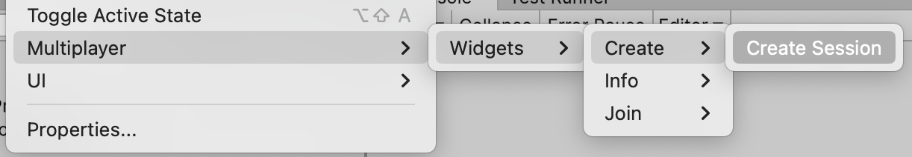
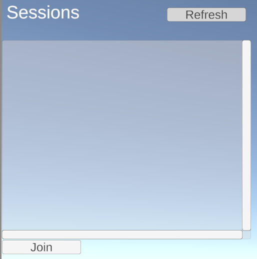
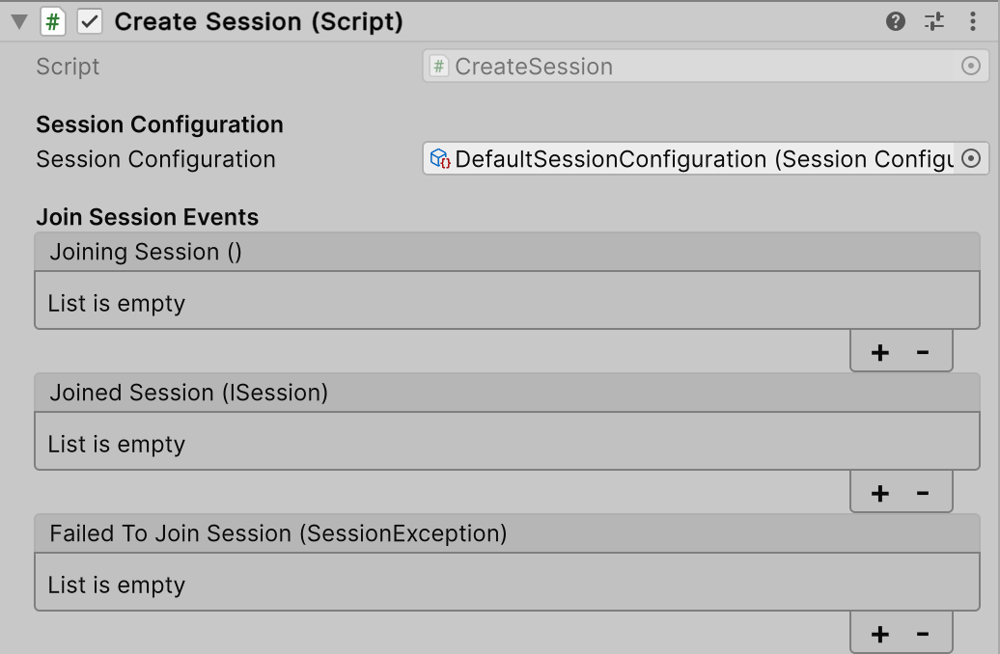
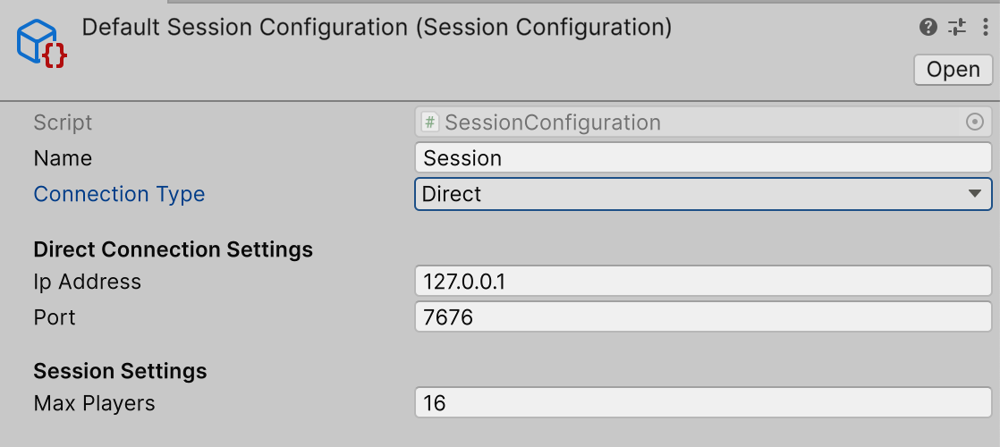

# Multiplayer Widgets
The Multiplayer Widgets package provides a set of Widgets that help implementing Unity's multiplayer services in a rapid prototyping fashion.

## Getting Started
You can access the current set of Widgets via the `Context Menu` in the `Hierarchy View`.

## Widgets
These are all the Widgets that are currently available.

### Create Session
This Widget allows you to create a new Session.

### Quick Create Session
This Widget allows you to quickly create a Session and join it.

#### Show Session Code
This Widget will automatically show the join code of a Session once a Session was joined.

### Join Session with Code
This Widget allows you to join a Session using the Session Code.

### Session List
This Widget allows you to see all available Sessions and join them.

## Session Configuration
Each Widget that joins a Session has a Session Configuration. This configuration is used to set different parameters for the Session.

The Session Configuration is used to set the following parameters:
- **Name**: Identifier of this Configuration.
- **Connection Type**: The type of connection to use. This can be `Relay` or `Direct`.
- **Ip Address and Port**: The Ip Address and Port to use when using a `Direct` connection.
- **Max Players**: The maximum number of players that can join this Session.

By default a `DefaultSessionConfiguration` is generated when adding a Widget to the scene. This configuration can be found in the `Asset Folder`.

## Known Limitations
- You can always only join one Session.
- The Session List is not updated in real time. You need to refresh it manually.